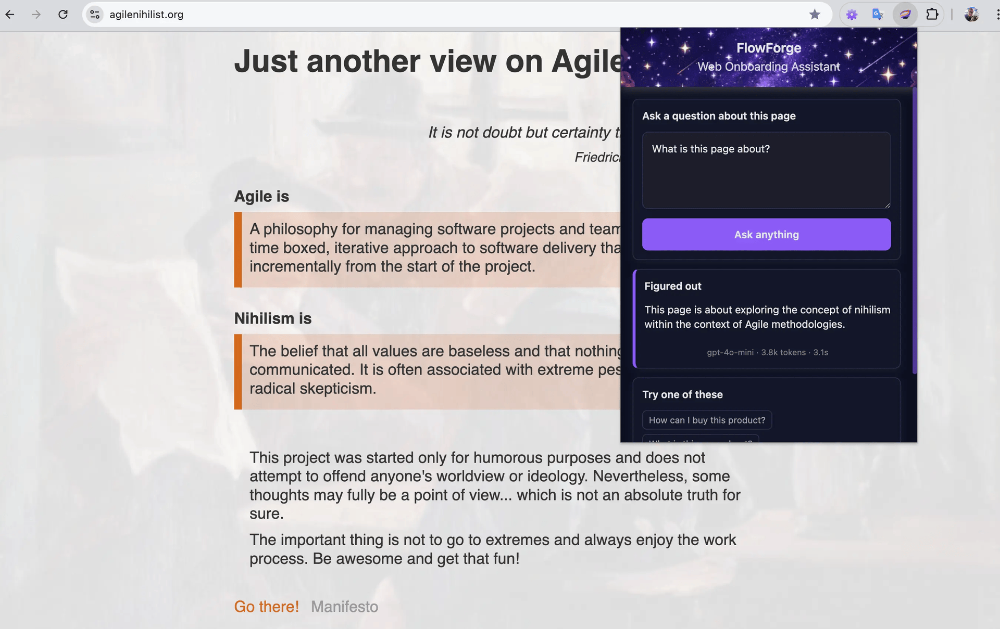
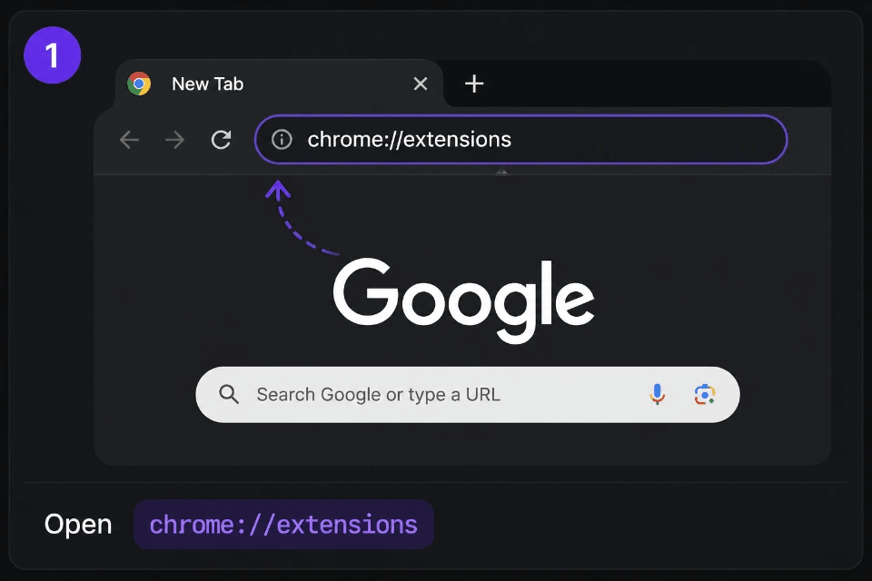

# FlowForge

_Forging your experience..._

FlowForge is a Web Onboarding Assistant that turns user intent into actionable UI guidance inside web applications.

- Explore content and interface instantly
- Ask anything about the page
- Get step-by-step onboarding flows

## Demo

Try the live **Demo** at [useflowforge.app](https://useflowforge.app/) ✦

## Overview

**Why?** Modern web apps are powerful – but hard to navigate.

The Assistant lets you ask questions in natural language and get immediate, contextual guidance directly in the UI.

It can:
- highlight relevant elements
- explain what's on the page
- guide users step-by-step through workflows

It works on any website out of the box and becomes product-aware when integrated.

**Under the hood:** browser extension + AI agent (ReAct) + RAG pipeline.

## Use Cases
- Ask a question and get a clear explanation of what the page is about.
- Locate links, buttons, or contacts without manual search.
- Follow step-by-step actions directly in the interface.
- Highlight and summarize important parts of long pages.
- Understand unfamiliar interfaces without onboarding.

<p align="left">
  
</p>

## Disclaimer

This is an early-stage experimental project showcasing the ✦ Idea ✦ itself.

It is not production-ready, and the core engine is still evolving. Expect limitations, rough edges, and ongoing improvements.

[Changelog](./CHANGELOG.md) – see the list of changes.

## Quick Start

### Prerequisites

- Node.js 22+
- Chrome / Chromium browser
- [Ollama](https://ollama.com/) (optional, for local LLM)

### Run

```bash
npm i
npm start
```

This will:

- Install dependencies
- Build backend and extension
- Guide you to install the extension in Chrome
- Start the backend at http://localhost:3477

<p align="left">
  
</p>

## Usage

1. Open any website
2. Click the Assistant extension icon
3. Ask a question, e.g.:
   - "Where is the login button?"
   - "How do I checkout?"
   - "Show me the search bar"
4. View the answer and highlighted elements directly on the page

## Security

- **DOM-only access** — operates strictly on the visible page DOM, without access to cookies or session storage
- **Sensitive data filtering** — excludes inputs like passwords, payment details, and other private fields during extraction
- **Local-first architecture** — backend and vector storage run locally by default
- **Optional local AI** — supports fully local inference via Ollama (no external API required)

Note: As an early-stage MVP, security is evolving and not yet production-ready.

## Roadmap

Focus areas:
1. Improve the core engine: extractors, embeddings, reasoning, and tools
2. Extend context from single pages to full websites
3. Build a proper standalone extension distribution

[Backlog](docs/BACKLOG.md) — the full list of features and improvements

## Documentation

- [Architecture](docs/ARCHITECTURE.md) — system design and component interaction
- [DOM to RAG Pipeline](docs/DOM-TO-RAG-PIPELINE.md) – from DOM to actionable intelligence
- [PageModel](packages/page-model/README.md) — DOM representation for UI understanding
- [Backend](apps/backend/README.md) — AI agent backend and RAG pipeline
- [Extension](apps/extension/README.md) — browser extension and page extraction

## License

MIT License ✦ 2026 Antony Belov

See [LICENSE](./LICENSE.md) for details.
