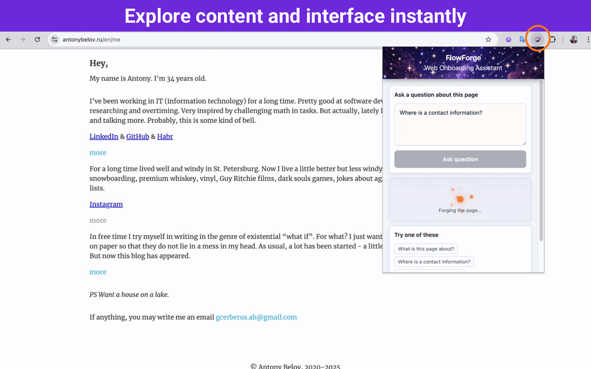

# FlowForge

_Forging your experience..._

FlowForge is a Web Onboarding Assistant that turns user intent into actionable UI guidance inside any web application.

- Find information and UI elements
- Ask questions in natural language
- Learn the product with guided onboarding

## Demo

<p align="left">
  
</p>

## Overview

**Why?** Modern web apps are powerful – but hard to navigate.

FlowForge lets users ask questions in natural language and get immediate, contextual guidance directly in the UI.

It can:
- highlight relevant elements
- explain what's on the page
- guide users step-by-step through workflows

It works on any website out of the box and becomes product-aware when integrated.

**Under the hood:** browser extension + AI agent (ReAct) + RAG pipeline.

## Disclaimer

It is an early-stage MVP built to showcase the ✦ Idea ✦ itself.

It is not production-ready yet, and the core engine is still under development. Expect limitations, rough edges, and ongoing improvements as the project evolves.

## Quick Start

### Prerequisites

- Node.js 22+
- Chrome / Chromium browser
- [Ollama](https://ollama.com/) (Optional, for local LLM)

### Run

```bash
npm i
npm start
```

This will:

- Install dependencies
- Build backend and extension
- Guide you to install the extension in Chrome
- Start the backend at http://localhost:3477

## Usage

1. Open any website
2. Click the FlowForge extension icon
3. Ask a question, e.g.:
   - "Where is the login button?"
   - "How do I checkout?"
   - "Show me the search bar"
4. View the answer and highlighted elements directly on the page

## Roadmap

Focus on:
1. Enhance the Core: extractors, embeddings, reasoning, tools
2. Provide a standalone Extension build
3. Landing with Demo

[Backlog](docs/BACKLOG.md) — the full list of features and improvements

## Documentation

- [Architecture](docs/ARCHITECTURE.md) — system design and component interaction
- [Backend](apps/backend/README.md) — AI agent and RAG pipeline
- [Extension](apps/extension/README.md) — browser extension and page extraction

## License

MIT © Antony Belov
