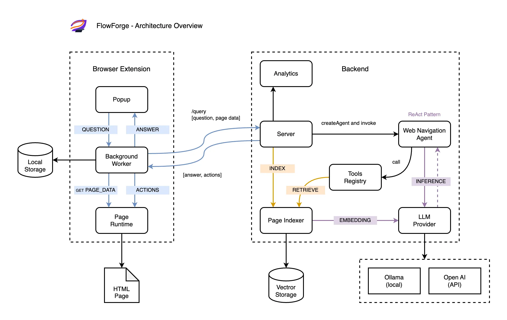

# Architecture

## Overview

FlowForge is a client–server system that connects user intent to UI-level actions inside web applications.

It consists of a Chrome extension (UI + page understanding) and a backend (AI agent + RAG pipeline) working together to provide contextual, actionable guidance.

## Components

### Extension

Extracts page data, handles UI, highlights elements, and manages user interaction. Runs in the browser as a Chrome extension with popup, background, and content scripts.

### Backend

Processes queries, runs the AI agent, manages vector storage, and exposes HTTP API. Built with Express and LangGraph.

### Agent

Interprets user intent and orchestrates tool usage using the ReAct pattern. Powered by LangGraph with structured tool calls.

### RAG Pipeline

Indexes page content into vector database (LanceDB) and retrieves relevant context for queries using semantic search.

### LLM Provider

Inference layer supporting local (Ollama) or cloud (OpenAI) models for embeddings and generation.

## Interaction Flow

### Query Flow

1. User asks a question in the extension popup
2. Extension sends `pageModel + question` to backend (`POST /query`)
3. Backend checks if page is indexed; indexes if needed
4. Agent executes with access to tools and vector search
5. Backend returns structured result (answer + target elements)
6. Extension highlights elements and displays response in popup

### Indexing Flow

1. Extension extracts page structure (content, interactive elements, navigation)
2. Backend splits data into documents with metadata
3. Embeddings are generated via LLM provider
4. Documents stored in vector database (LanceDB)
5. Available for semantic search during query processing

## Pipeline

High-level overview of the DOM-to-RAG pipeline:

1. **Extraction** — DOM → structured `PageModel` (content + interactive elements + context)
2. **Transformation** — `PageModel` → semantic `IndexableDocuments` with metadata
3. **Indexing** — Documents → embeddings → vector storage (LanceDB)
4. **Retrieval** — Query → Top-K relevant documents via semantic search
5. **Reranking** — Hybrid scoring (semantic + importance signals)
6. **Resolution** — Documents → actionable tool results (selectors + descriptions)

See [DOM-TO-RAG-PIPELINE.md](DOM-TO-RAG-PIPELINE.md) for detailed pipeline documentation.

## Key Decisions

**ReAct agent (LangGraph)**
Provides reliable tool-based reasoning with full control over execution flow and observability.

**RAG over page context**
Enables accurate, contextual answers by retrieving relevant page content instead of relying solely on agent memory.

**LanceDB**
Embedded vector storage with no external dependencies. Runs locally alongside the backend.

**Local + Cloud LLM**
Flexibility between privacy (Ollama) and performance (OpenAI) depending on user needs.

## Contracts

### Extension ↔ Backend

HTTP API with main endpoints:

- `POST /query` — submit user question with page data
- `POST /search` — semantic search over indexed content
- `GET /analytics` — usage data and query tracking
- `GET /health` — service status

### Agent ↔ Tools

Structured tool calls with typed inputs/outputs defined via Zod schemas.

### Indexer ↔ Storage

Embeddings + metadata stored per page. Each document includes source URL, type (content/element), and original text.

## Constraints

**Single-page context**
No cross-page memory or session continuity. Each query operates on current page only.

**Local backend**
Designed for single-user local deployment. No authentication or multi-tenancy.

**In-memory analytics**
Query tracking and usage data stored in memory. No persistence across restarts.
