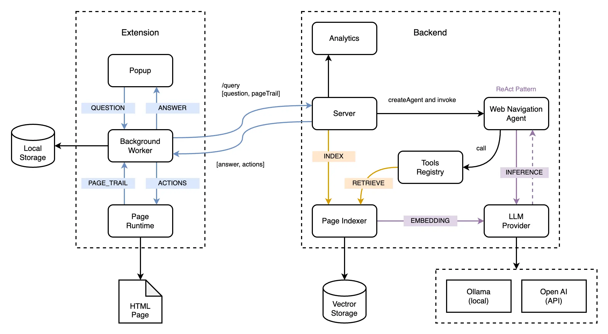

# Architecture

## Overview

FlowForge is a client–server system that connects user intent to UI-level actions. A Chrome extension or embeddable runtime handles page/UI work; the backend runs the AI agent and RAG pipeline.

## Components

### Extension

Extracts page data, handles UI, highlights elements, and manages user interaction. Runs as a Manifest V3 extension with popup, background service worker, and content script.

### Embed runtime

Website-embedded bundle that can use the local backend or a demo API client with predefined responses.

### Backend

Processes queries, runs the AI agent, manages vector storage, and exposes HTTP API. Built with Express, LangChain/LangGraph primitives, and LanceDB.

### Agent

Interprets user intent and orchestrates tool usage with the ReAct pattern and structured tool calls.

### RAG pipeline

Indexes page content into LanceDB and retrieves relevant context for queries using semantic search.

### LLM provider

Inference layer supporting Ollama or OpenAI models for embeddings and generation.

## Interaction flow

### Query flow

1. User asks a question in the extension popup or embed shell
2. Extension sends `pageTrail + question` to backend (`POST /query`)
3. Backend indexes the submitted page snapshot
4. Agent executes with access to tools and vector search
5. Backend returns `QueryResponse` with `result` and execution metadata
6. Browser runtime highlights elements and displays the response

### Indexing flow

1. Browser runtime extracts page structure (`basics`, `content`, `interactive`, `metadata`)
2. Backend splits data into documents with metadata
3. Embeddings are generated via LLM provider
4. Documents stored in vector database (LanceDB)

## Pipeline

High-level overview of the DOM-to-RAG pipeline:

1. **Extraction** — DOM → structured `PageTrail` (content + interactive elements + context)
2. **Transformation** — `PageTrail` → semantic `IndexableDocuments` with metadata
3. **Indexing** — Documents → embeddings → vector storage (LanceDB)
4. **Retrieval** — Query → Top-K relevant documents via semantic search
5. **Reranking** — Hybrid scoring (semantic + importance signals)
6. **Resolution** — Documents → actionable tool results (selectors + descriptions)

## Key decisions

**ReAct agent (LangGraph)**
Provides tool-based reasoning with controlled execution flow and observability.

**RAG over page context**
Retrieves relevant page content instead of relying only on agent memory.

**LanceDB**
Embedded vector storage that runs locally alongside the backend.

**Local + cloud LLM**
Switches between local Ollama and OpenAI providers.

**Typed contracts**
Shared request/response contracts live in `@flowforge/contract`; DOM snapshots live in `@flowforge/page-trail`.

## Contracts

Browser runtime ↔ backend:

- `POST /query` — submit user question with page data
- `POST /search` — semantic search over an already indexed page URL
- `GET /health` — service status
- `GET /analytics` — in-memory query analytics

`POST /query` accepts `question`, `pageTrail`, `domain`, and optional `userContext.previousQuestions`. It indexes the submitted page before agent execution and returns `{ result, metadata }`.

`result` is an `AgentResult` with `answer`, `mode`, optional `topic`, and target `elements`. `metadata` includes model, token usage, and execution time. `POST /search` accepts `pageUrl`, `query`, and optional `k`, then returns retrieved documents.

Agent tools use structured Zod schemas. Indexer documents are stored per page URL and embedding provider with content text and source element metadata.

## Constraints

**Single-page context**
No cross-page DOM memory. Each query operates on the submitted page snapshot. The extension keeps short per-domain question history.

**Local backend**
Designed for single-user local deployment. No authentication or multi-tenancy.
