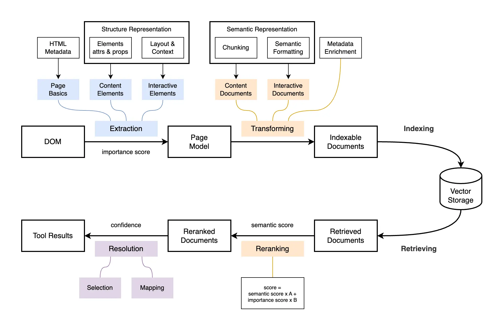

# DOM-to-RAG Pipeline

## Overview

A lightweight architecture that transforms raw DOM into actionable, UI-aware answers using a Retrieval-Augmented Generation (RAG) approach.

Modern web applications expose rich information through the DOM, but it is not directly usable for AI reasoning.

This pipeline converts the DOM into a structured, searchable, and actionable representation.



---

## Stages

### 1. Extraction to Structure Representation

The DOM is parsed and normalized into a structured `PageModel`.

This stage captures both the raw structure and contextual meaning of the UI.

Includes:
- Page basics (title, URL, metadata)
- Content elements (text, headings)
- Interactive elements (buttons, inputs, links)

Each element contains:
- Attributes and properties
- Semantic roles and labels
- Embedded layout and context:
    - Section (e.g., header, main, form)
    - Hierarchical path within the page

Each element is also assigned an importance score.

This layer defines *what exists on the page and how it is structured*.

### 2. Transforming to Semantic Representation

Transforms structured page data into AI-friendly, human-readable `IndexableDocuments` enriched with metadata for retrieval.

Includes:
- Chunking (splitting content into manageable pieces)
- Semantic formatting (constructing descriptions using element attributes, roles, labels, and context)
- Metadata enrichment:
    - Context (section, path)
    - Element references (selector, dataId)
    - Importance signals
- Separation into:
    - Content Documents (informational text)
    - Interactive Documents (actionable UI elements)

This layer defines *what the page means and how it can be interpreted and retrieved by AI*.

### 3. Indexing / Retrieval

Documents are embedded, stored in a vector database, and retrieved at query time based on semantic similarity.

Includes:
- Embedding documents into vector representations
- Storing them for efficient similarity search
- Retrieving Top-K relevant documents for a given query

This layer enables fast and context-aware access to relevant UI information.

### 4. Reranking

Retrieved documents are rescored to improve relevance using a combination of semantic similarity and UI-specific signals.

A hybrid scoring function is applied:
```
score = semantic_score * A + importance_score * B
```

Where:
- `semantic_score` reflects how well the document matches the query
- `importance_score` reflects UI relevance (e.g., visibility, role, position, interaction potential)

This step prioritizes elements that are not only semantically relevant, but also meaningful and actionable for the user.

### 5. Resolution to Tool Results

Transforms ranked documents into final, actionable outputs that Agent can directly use.

Includes:
- **Selection** — choosing the most relevant candidates from reranked documents
- **Mapping** — converting documents into structured UI targets

Produces:
- Element references (selector, dataId)
- User-facing descriptions
- Action hints (click, input, navigate)

This stage bridges retrieval and real UI interaction by turning data into executable guidance.
