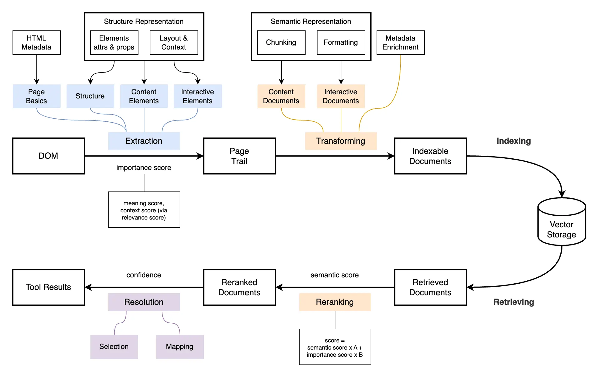

# DOM-to-RAG pipeline

## Overview

FlowForge converts raw DOM into structured, searchable, UI-aware context for Retrieval-Augmented Generation (RAG).



---

## Stages

### 1. Extraction to structure representation

The browser runtime parses the DOM into a structured `PageTrail`.

Includes:

- Page basics (URL, title, description, language, viewport)
- Content elements (text, headings)
- Interactive elements (buttons, inputs, links)
- Collection metadata (counts, limit flags, collected time, duration)

Elements include:

- Attributes and properties
- Semantic roles and labels
- Embedded layout and context:
    - Section (e.g., header, main, form)
    - Hierarchical path within the page
- Stable `dataId` and optional CSS selector for browser-side lookup

Each element is assigned an importance score. This layer defines _what exists on the page and how it is structured_.

### 2. Transforming to semantic representation

Transforms `PageTrail` into AI-friendly `IndexableDocuments`.

Includes:

- Chunking (splitting content into manageable pieces)
- Semantic formatting (constructing descriptions using element attributes, roles, labels, and context)
- Metadata enrichment:
    - Context (section, path)
    - Element references (selector, dataId)
    - Importance signals
- Separation into:
    - Content documents (informational text)
    - Interactive documents (actionable UI elements)

This layer defines _what the page means and how it can be retrieved by AI_.

### 3. Indexing / retrieval

Documents are embedded, stored in LanceDB, and retrieved at query time by semantic similarity.

Includes:

- Embedding documents into vector representations
- Storing them in LanceDB under a dataset derived from provider + page URL
- Retrieving top-k relevant documents for a given query
- Optional filtering by document type (`content` or `interactive`)

This layer provides context-aware access to relevant UI information.

### 4. Reranking

Retrieved documents are rescored with semantic similarity and UI-specific signals.

A hybrid scoring function is applied by the agent tools:

```
score = semantic similarity + UI importance signals
```

Where:

- `semantic_score` reflects how well the document matches the query
- `importance_score` reflects UI relevance such as visibility, role, position, and interaction potential

Different tools use different scoring profiles for lookup, answer, and action-oriented requests.

### 5. Resolution to tool results

Transforms ranked documents into actionable outputs that the agent can use.

Includes:

- **Selection** — choosing the most relevant candidates from reranked documents
- **Mapping** — converting documents into structured UI targets

Produces:

- Element references (selector, dataId)
- User-facing descriptions
- Action hints (`click`, `input`, `select`, `navigate`, `highlight`)

The final backend response is validated as an `AgentResult`; invalid `dataId` values are filtered before response.

This stage bridges retrieval and real UI interaction by turning data into executable guidance.
