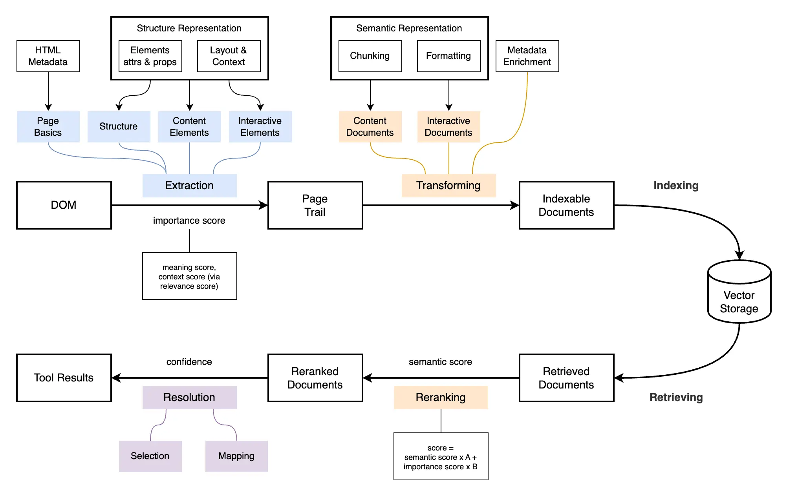

# DOM-to-RAG pipeline

## Overview

FlowForge converts raw DOM into structured, searchable, UI-aware context for Retrieval-Augmented Generation (RAG).

For more information about the canonical DOM snapshot format, see
[`packages/page-trail/README.md`](../packages/page-trail/README.md).



## Stages

### 1. Extraction to structure representation

The browser runtime parses the DOM into a runtime `PageTrail`, serializes it as
`PageTrailDto`, and the backend reconnects its ID relationships.

Includes:

- Page basics (URL, title, description, language, viewport)
- Content elements (text, headings)
- Interactive elements (buttons, inputs, links)
- Collection metadata (counts, limit flags, collected time, duration)

Elements include:

- Attributes and properties
- Semantic roles and labels
- Embedded layout and context, including section and ancestor path
- Numeric snapshot identity for relationships inside PageTrail
- Optional locator with a stable `dataId` and CSS selector fallback for browser-side lookup

The DTO stores each element once. Tree and context links use IDs that the runtime
model resolves into shared references. Context-only collection omits locators.

PageTrail assigns query-agnostic scoring signals for target selection; see [`PageTrail Scoring`](../packages/page-trail/docs/scoring.md) for details.

### 2. Transforming to semantic representation

Transforms `PageTrail` into AI-friendly `IndexableDocuments`.

Includes:

- Chunking (splitting content into manageable pieces)
- Semantic formatting (constructing descriptions using element attributes, roles, labels, and context)
- Metadata enrichment:
    - Context (section, path)
    - Optional locator data (`dataId` and CSS selector)
    - Importance signals
- Separation into:
    - Content documents (informational text)
    - Interactive documents (actionable UI elements)

### 3. Indexing / retrieval

Documents are embedded, stored in LanceDB, and retrieved at query time by semantic similarity.

Includes:

- Embedding documents into vector representations
- Storing them in LanceDB under a dataset derived from provider + page URL
- Retrieving top-k relevant documents for a given query
- Optional filtering by document type (`content` or `interactive`)

### 4. Reranking

Retrieved documents are rescored with semantic similarity and UI-specific signals.

A hybrid scoring function is applied by the agent tools:

```
score = semanticScore * weight + importanceScore * weight
```

Where:

- `semanticScore` reflects how well the document matches the query
- `importanceScore` carries the query-agnostic PageTrail target selection signal

Lookup, answer, and action-oriented tools use different weights.

### 5. Resolution to tool results

Transforms ranked documents into actionable outputs that the agent can use.

Includes:

- **Selection** — choosing the most relevant candidates from reranked documents
- **Mapping** — converting documents into structured UI targets

Produces:

- DOM locator data when the submitted PageTrail is not context-only
- User-facing descriptions
- Action hints (`click`, `input`, `select`, `navigate`, `highlight`)

The final backend response is validated as an `AgentResult`; invalid `dataId` values are filtered before response.
