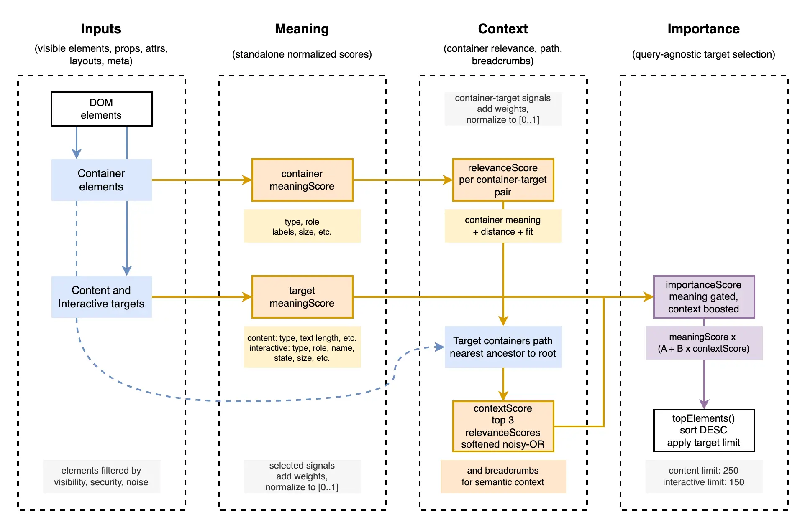

# PageTrail Scoring

`@flowforge/page-trail` scoring selects useful DOM targets for the `PageTrail`
snapshot. It is query-agnostic: the user request is applied later by retrieval
and reranking in the DOM-to-RAG pipeline.

## Overview

PageTrail scoring runs after collector filtering. The collector keeps supported
visible containers, content blocks, and interactive targets, then removes
unsupported, hidden, sensitive, or too-small/noisy nodes before target
selection.

The scoring flow has four parts: inputs, meaning, context, and importance.

## Scoring Diagram



## Inputs

Inputs are visible elements, properties, attributes, text, state, layout, and
page metadata. Containers become structure elements. Content and interactive
elements become targets that can be selected for retention.

## Meaning

`meaningScore` describes an element by itself. Containers use type, role,
labels, and size. Content targets use content type and text length. Interactive
targets use type, role, name, usability, required state, and size.

Container, content, interactive, and relevance scores use additive weighted
signals. Selected signal weights are summed into a raw score:

```text
rawScore = sum(selectedSignalWeights)
```

The raw score is normalized to `[0..1]` using the scoring range inferred from
the configured weights:

```text
score = clamp((rawScore - minScore) / (maxScore - minScore), 0, 1)
```

The normalized `meaningScore` is stored on all extracted elements. Container
elements are not importance-scored or limited.

## Context

Content and interactive targets store a container path from the nearest ancestor
toward the page root. Each path node receives a `relevanceScore` for that
specific container-target pair.

`relevanceScore` is computed from container `meaningScore`, distance from the
target, and target/container fit. Target `meaningScore` is not used here; the
target contributes descriptors such as content type, interactive type, or
interactive role.

`contextScore` aggregates the strongest container context from the target path.
It takes up to three path nodes with the highest `relevanceScore` values and
combines them with a softened noisy-OR:

```text
contextScore = 1 - product(1 - relevanceScore^2)
```

Squaring each relevance score reduces the effect of weak context while still
allowing several strong containers to reinforce one another. Breadcrumb indexes
identify the path nodes that contributed to the context score.

## Importance

`importanceScore` is computed only for content and interactive targets. It
combines standalone target meaning with bounded context support:

```text
importanceScore = meaningScore * (BASE_MEANING_WEIGHT + CONTEXT_BOOST_WEIGHT * contextScore)
```

`meaningScore` gates the final score. If target meaning is `0`, context cannot
make the target important. With no useful context, the target keeps its base
meaning weight. With perfect context, the final score reaches the full
`meaningScore` when the configured weights sum to `1`.

After scoring, `topElements()` sorts content and interactive candidates by
`importanceScore` in descending order and applies the configured target limits.
The default retained limits are `CONTENT_ELEMENTS_LIMIT` for content elements
and `INTERACTIVE_ELEMENTS_LIMIT` for interactive elements.
